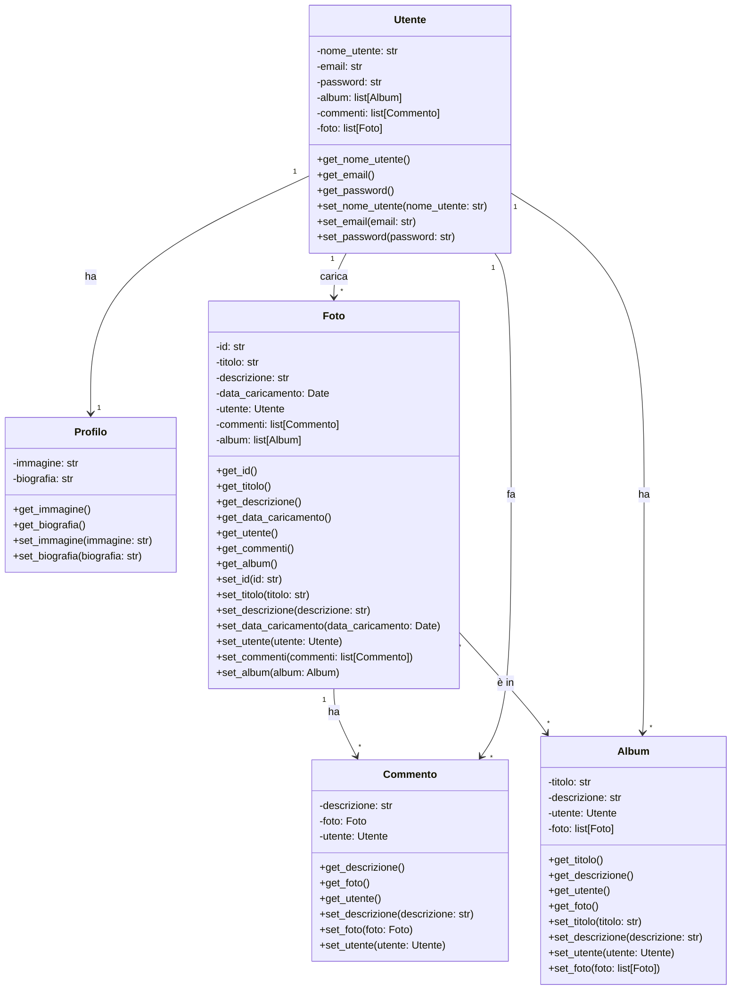

# Esercizio 23

```mermaid

classDiagram

    class Utente{
    
    
        -nome_utente: str
        -email: str
        -password: str
        -album: list[Album]
        -commenti: list[Commento]
        -foto: list[Foto]
        +get_nome_utente()
        +get_email() 
        +get_password()
        +set_nome_utente(nome_utente: str)
        +set_email(email: str)
        +set_password(password: str)
    }


    class Profilo {
    
        -immagine: str
        -biografia: str
        +get_immagine()
        +get_biografia()
        +set_immagine(immagine: str)
        +set_biografia(biografia: str)

    
    }


    class Foto{
    
        -id: str
        -titolo: str
        -descrizione: str
        -data_caricamento: Date
        -utente: Utente
        -commenti: list[Commento]
        -album: list[Album]
        +get_id()
        +get_titolo()
        +get_descrizione()
        +get_data_caricamento()
        +get_utente()
        +get_commenti()
        +get_album()
        +set_id(id: str)
        +set_titolo(titolo: str)
        +set_descrizione(descrizione: str)
        +set_data_caricamento(data_caricamento: Date)
        +set_utente(utente: Utente)
        +set_commenti(commenti: list[Commento])
        +set_album(album: Album)
    }


    class Album{

        -titolo: str
        -descrizione: str
        -utente: Utente
        -foto: list[Foto]
        +get_titolo()
        +get_descrizione()
        +get_utente()
        +get_foto()
        +set_titolo(titolo: str)
        +set_descrizione(descrizione: str)
        +set_utente(utente: Utente)
        +set_foto(foto: list[Foto])

    }


    class Commento{


        -descrizione: str
        -foto: Foto
        -utente: Utente
        +get_descrizione()
        +get_foto()
        +get_utente()
        +set_descrizione(descrizione: str)
        +set_foto(foto: Foto)
        +set_utente(utente: Utente)
    

    
    
    }

Utente "1" --> "*" Foto : carica
Foto "1" --> "*" Commento : ha
Foto "*" --> "*" Album : è in 
Utente "1" --> "*" Album : ha 
Utente "1" --> "1" Profilo : ha 
Utente "1" --> "*" Commento: fa


```