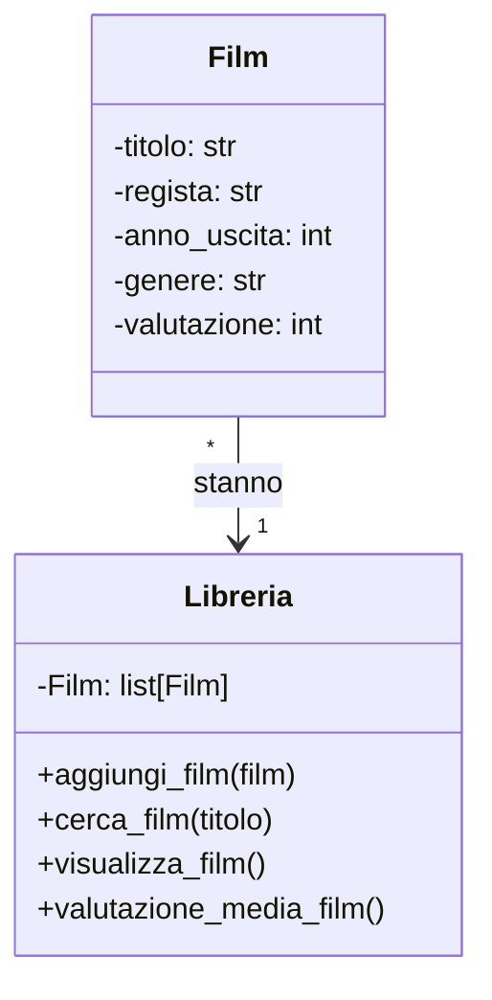

# Esercizio 24

```mermaid

classDiagram

    class Film{
    
        -titolo: str
        -regista: str
        -anno_uscita: int
        -genere: str
        -valutazione: int
    
    }


    class Libreria{
    
        -Film: list[Film]
        +aggiungi_film(film)
        +cerca_film(titolo)
        +visualizza_film()
        +valutazione_media_film()
    
    }


Film "*" --> "1" Libreria : stanno


```