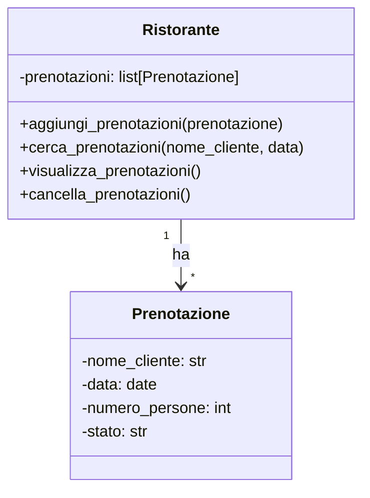

# Esercizio 25

```mermaid

classDiagram

    class Prenotazione{
    
        -nome_cliente: str
        -data: date
        -numero_persone: int
        -stato: str
    }

    class Ristorante{
    
        -prenotazioni: list[Prenotazione]
        +aggiungi_prenotazioni(prenotazione)
        +cerca_prenotazioni(nome_cliente, data)
        +visualizza_prenotazioni()
        +cancella_prenotazioni()
    
    }


Ristorante "1" --> "*" Prenotazione : ha 
 
```