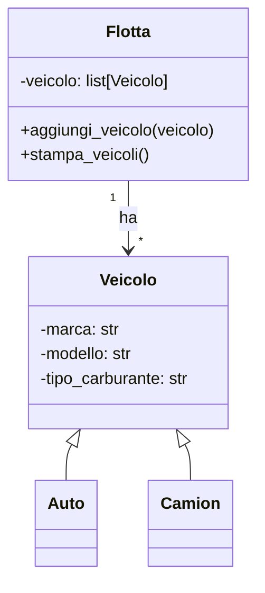

# Esercizio 26

```mermaid

classDiagram

    class Veicolo{
    
        -marca: str
        -modello: str
        -tipo_carburante: str

    }


    class Auto{
    
    }

    class Camion{
    
    }

    class Flotta{
    
    -veicolo: list[Veicolo]
    +aggiungi_veicolo(veicolo)
    +stampa_veicoli()

    }

Flotta "1" --> "*" Veicolo : ha
Veicolo <|-- Auto
Veicolo <|-- Camion  


```