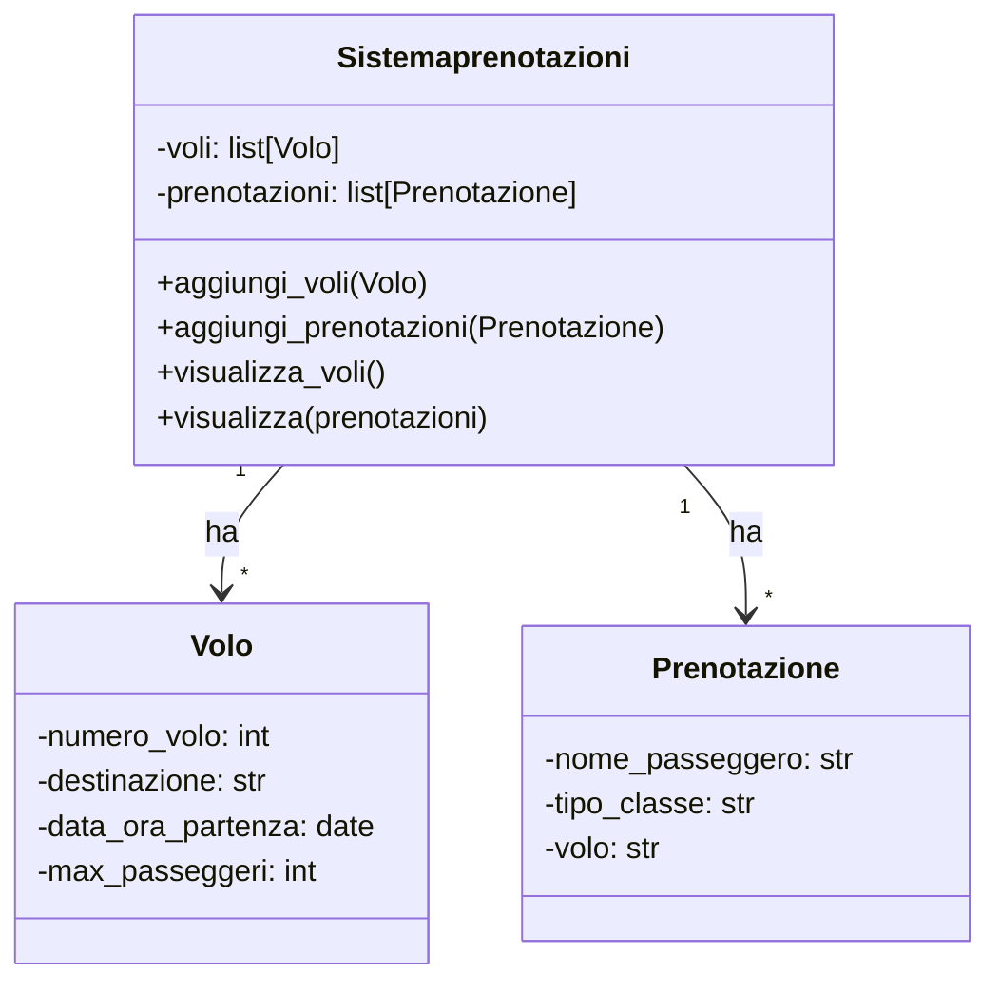

# Esercizio 27

```mermaid

classDiagram

    class Volo{
    
        -numero_volo: int
        -destinazione: str
        -data_ora_partenza: date
        -max_passeggeri: int

    }

    class Prenotazione{
    
        -nome_passeggero: str
        -tipo_classe: str
        -volo: str
    
    }

    class Sistemaprenotazioni{
    
        -voli: list[Volo]
        -prenotazioni: list[Prenotazione]
        +aggiungi_voli(Volo)
        +aggiungi_prenotazioni(Prenotazione)
        +visualizza_voli()
        +visualizza(prenotazioni)

    }

Sistemaprenotazioni "1" --> "*" Volo : ha
Sistemaprenotazioni "1" --> "*" Prenotazione : ha

```