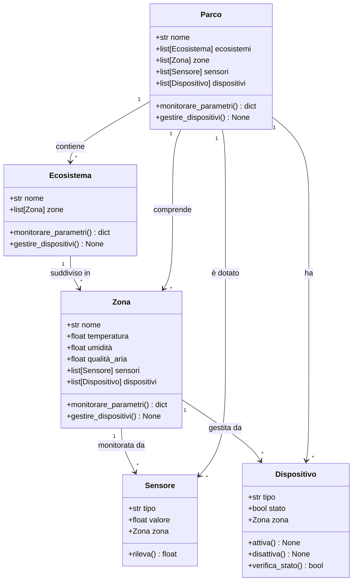

# Esercizio 29

```mermaid

classDiagram

    class Ecosistema {
        +str nome
        +list[Zona] zone
        +monitorare_parametri() dict
        +gestire_dispositivi() None
    }

    class Parco {
        +str nome
        +list[Ecosistema] ecosistemi
        +list[Zona] zone
        +list[Sensore] sensori
        +list[Dispositivo] dispositivi
        +monitorare_parametri() dict
        +gestire_dispositivi() None
    }

    class Zona {
        +str nome
        +float temperatura
        +float umidità
        +float qualità_aria
        +list[Sensore] sensori
        +list[Dispositivo] dispositivi
        +monitorare_parametri() dict
        +gestire_dispositivi() None
    }

    class Sensore {
        +str tipo
        +float valore
        +Zona zona
        +rileva() float
    }

    class Dispositivo {
        +str tipo
        +bool stato
        +Zona zona
        +attiva() None
        +disattiva() None
        +verifica_stato() bool
    }

    Parco "1" --> "*" Ecosistema : contiene
    Ecosistema "1" --> "*" Zona : suddiviso in
    Zona "1" --> "*" Sensore : monitorata da
    Zona "1" --> "*" Dispositivo : gestita da
    Parco "1" --> "*" Zona : comprende
    Parco "1" --> "*" Sensore : è dotato
    Parco "1" --> "*" Dispositivo : ha


```