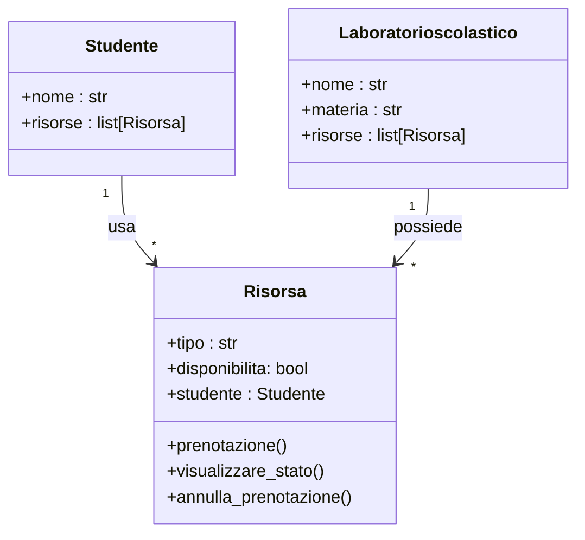

# Esercizio 30

```mermaid

classDiagram

    class Studente{
        
        +nome : str
        +risorse : list[Risorsa]


    }

    class Risorsa{

        +tipo : str
        +disponibilita: bool
        +studente : Studente
        +prenotazione() 
        +visualizzare_stato() 
        +annulla_prenotazione()
    


    }


    class Laboratorioscolastico{

        +nome : str
        +materia : str
        +risorse : list[Risorsa]
    


    }


Studente "1" --> "*" Risorsa : usa
Laboratorioscolastico "1" --> "*" Risorsa: possiede


```