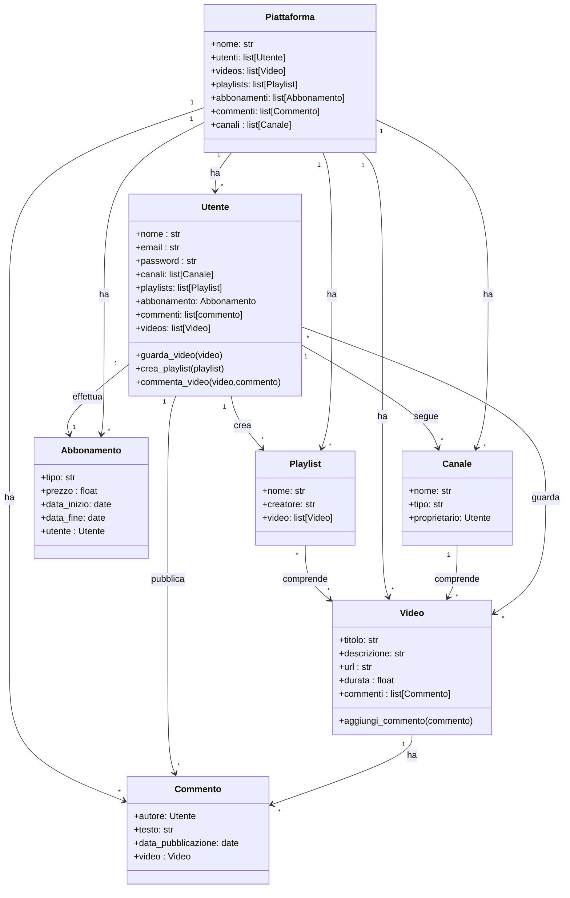

# Esercizio 32

```mermaid
classDiagram

    class Utente{
        +nome : str
        +email : str
        +password : str

        +canali: list[Canale]
        +playlists: list[Playlist]
        +abbonamento: Abbonamento
        +commenti: list[commento]
        +videos: list[Video]
        +guarda_video(video)
        +crea_playlist(playlist)
        +commenta_video(video,commento)
        

    }


    class Video{
        +titolo: str
        +descrizione: str
        +url : str
        +durata : float

        +commenti : list[Commento]
        +aggiungi_commento(commento)


    
    }

    
    class Playlist{
        +nome: str
        +creatore: str

        +video: list[Video]

    }


    class Abbonamento{
        +tipo: str
        +prezzo : float
        +data_inizio: date
        +data_fine: date
        
        +utente : Utente

    
    }

    class Commento{
        +autore:  Utente
        +testo: str
        +data_pubblicazione: date
        +video : Video
    
    }

    class Piattaforma{
        +nome: str

        +utenti: list[Utente]
        +videos: list[Video]
        +playlists: list[Playlist]
        +abbonamenti: list[Abbonamento]
        +commenti: list[Commento]
        +canali : list[Canale]    
    }

    class Canale{
        +nome: str
        +tipo: str
        +proprietario: Utente


    }


Playlist "*" --> "*" Video : comprende
Utente "1" --> "*" Playlist : crea
Utente "1" --> "1" Abbonamento : effettua
Piattaforma "1" --> "*" Utente : ha
Piattaforma "1" --> "*" Video : ha
Piattaforma "1" --> "*" Playlist : ha
Piattaforma "1" --> "*" Abbonamento : ha
Piattaforma "1" --> "*" Commento : ha
Utente "1" --> "*" Canale : segue
Utente "1" --> "*" Commento : pubblica
Video "1" --> "*" Commento : ha 
Piattaforma "1" --> "*" Canale : ha
Canale "1" --> "*" Video : comprende  
Utente "*" --> "*" Video: guarda


```